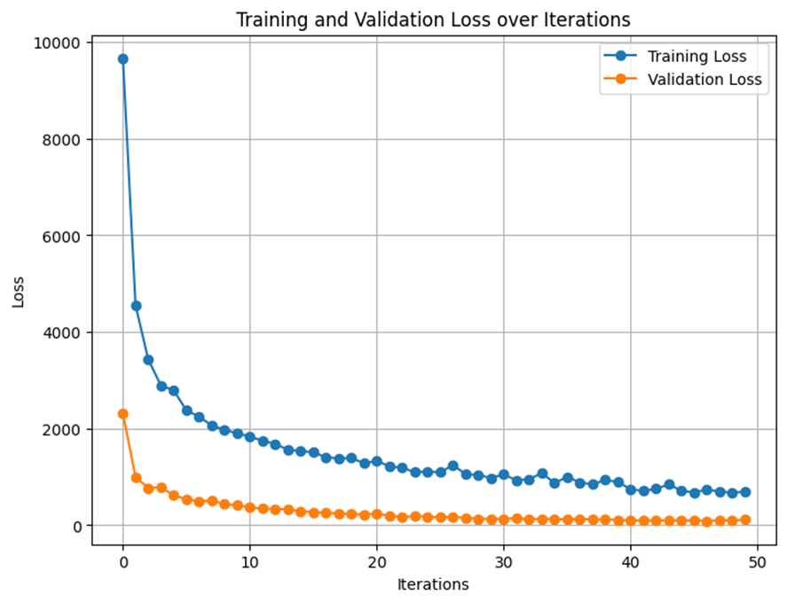
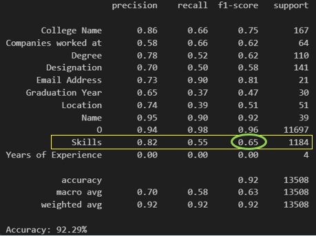
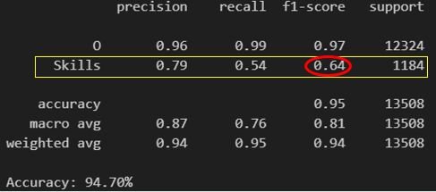
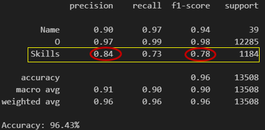
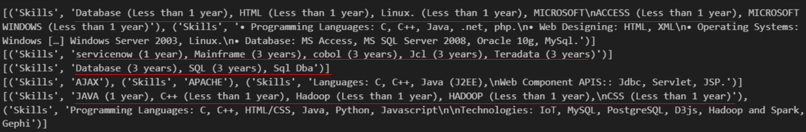
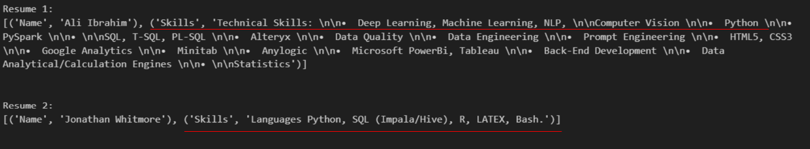
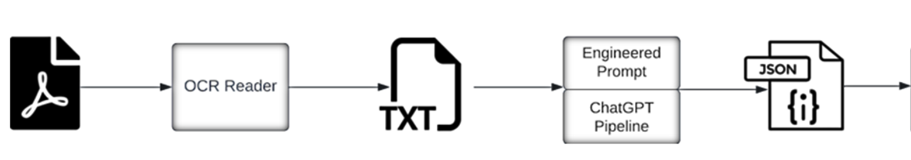
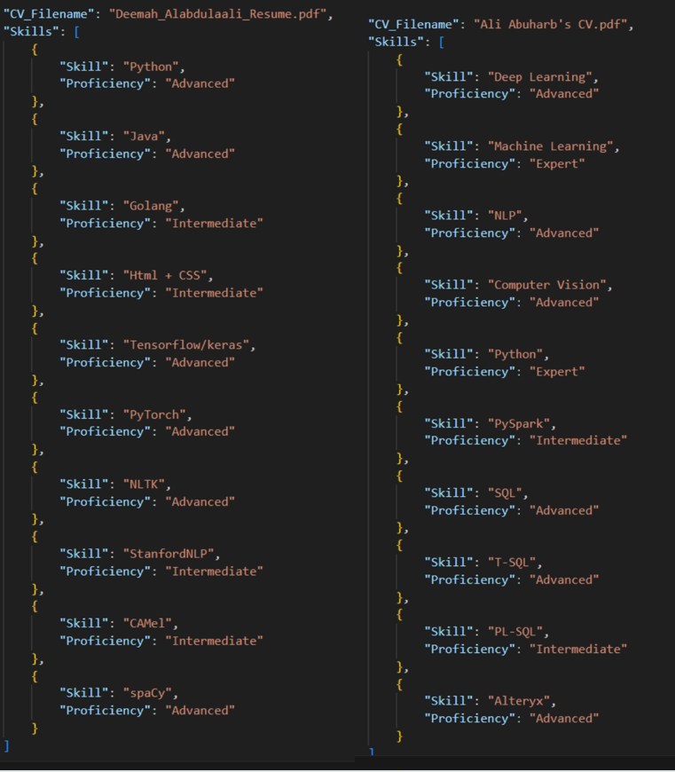

# Skills-Extraction-from-Resume-NER-and-GPT-prompt
This repo is supposed to implement extracting skills with corresponding proficiency levels from a resume. 

## Methods

I used the following two methods to compare the differences:
1. Name Entity Recognition (NER)   
**Named-Entity Recognition (NER)** is a subtask of information extraction in Natural Language Processing (NLP) that identifies and classifies entities in a text into predefined categories such as names of **persons, organizations, locations, dates,** and other important information. When applied to resume skills extraction, NER can be a powerful tool for automatically identifying and categorizing skills mentioned in resumes. Code is adapted from this [repo](https://github.com/DataTurks-Engg/Entity-Recognition-In-Resumes-SpaCy).  

2. GTP + prompt engineering   
It is also possible to extract via engineering Prompt and call the GPT API to extract relevant information. Methods and Code are adapted from this [repo](https://github.com/Aillian/ResumeGPT).   

## Getting Started

### Dependencies

* python=3.10.9; cuda version: 11.8
* Other required packages are listed in requirement.txt
* Environment: Linux (Ubuntu 22.04.2 LTS)

### Installing

* Creat a virtual conda environment to avoid conflicts of version
```
conda create --name NER python=3.10.9
```
* Activate the environment
```
conda activate NER
```
* Install the Dependencies
```
pip3 install -r requirements.txt --extra-index-url https://download.pytorch.org/whl/cu118
```

## Run the NER method   
 
### Run the Jupyter file in ./NER/SkillsExtraction_final.ipynb 

* Run the Jupyter Notebook in ./NER/SkillsExtraction_final.ipynb to experiment of different settings such as different epochs and different entities.

### Results
* Train and validation loss   
Notice that train loss dose not go to zero because of the noisy feature and complexity of the task  
  

* Performance VS different selected entities   
When specifying the targets, you can use all combinitions of different annodated entities from {'College Name', 'Companies worked at', 'Degree', 'Designation', 'Email Address', 'Graduation Year', 'Location', 'Name', 'Skills', 'UNKNOWN', 'Years of Experience'} as the targets. And in the inference you care only about the extracted 'skills'. It is found that such combinitions leads to different performance. This is also called single-task versus multi-task learning in the context of skill extraction. For more information, please have a look at this [article](https://arxiv.org/abs/2204.12811)    
1. use all entities as targets (best epochs = 10), we find f1=score is only 65% for the skills extraction accuracy  
  
2. use entities =  {"Skills"} as targets (best epochs = 10), we find f1=score is around 64% for the skills extraction accuracy  
  
3. use Use entities =  {"Skills", "Name"} as targets (best epochs = 30), we find f1=score is improved to 78% for the skills extraction accuracy  
  

### Test performance visulization
* Test performance with data from testdata.json  
It can be seen that the trained model can correctly extract the skills with relevant proficiency level if it is already specified in the resume, but it cannot show if it is not explicitely mentioned.      
 
* Test performance with with real pdf as input  
In this case, a pdf reader is firstly used to extract the content and format the same as the train set in a json file. We use pdfminer to extract content in the first step.   


## Run GPT+prompt method
This is quite straightforward to implement as shown in the following pipeline (adapted from the [repo](https://github.com/Aillian/ResumeGPT)). Notice here it is very important to engineering properly the prompt according to your need. The engineering prompt is under the folder of GPT/Engineered_Prompt     



### Run the following command line in the folder of GPT 
* "../data/Resume_data_pdf" is your CVs Directory Path  
* "sk-labdMNjkgJHiFnbLHBJcccfKNBDFJTYCVfvRedevDdf" is your Openai API Key which should include GPT-4 model access    
```
python main.py "../data/Resume_data_pdf" "sk-labdMNjkgJHiFnbLHBJcccfKNBDFJTYCVfvRedevDdf"
```
### Results
* Below is the visualization of two CVs' outputs after running the main.py. It can be seen that GPT can accurately extract the relevant skills with proficiency levels.   


## Summary
### NER-Based Model:
* Strengths:
1. Tailored entity recognition allows for customization to identify specific skill-related entities.    
2. Efficient processing of structured or semi-structured text.    
3. Fast inference, making it suitable for quick processing tasks.   
* Limitations:
1. Requires annotated training data, which can be resource-intensive to prepare.    
2. Limited flexibility and weak context understanding, making it less effective in dynamically varying or complex contexts.  

### GPT-Based Model:
* Strengths:
1. Strong contextual understanding, enabling it to interpret and extract information from diverse and unstructured text.        
2. High flexibility and adaptability to different tasks and domains.   
* Limitations:
1. Computationally expensive and has longer response times compared to NER-based models. 

### Domain-Specific LLM:
* Mentioned as an option, likely to leverage the strengths of both approaches by focusing on specific domain expertise while maintaining flexibility and contextual understanding.

## Authors
Contributors names and contact info

[@XingCHEN](xing.chen@cnrs-thales.fr)
